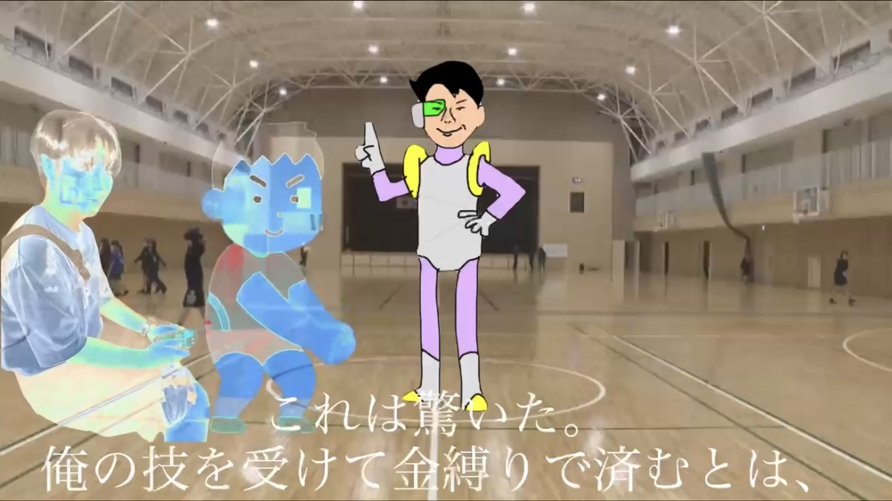

<!DOCTYPE html>
<html lang="ja">
<head>
  <meta charset="UTF-8">
  <title>アーカイブページ</title>
  
</head>
<body>

  <h1>凱友伝</h1>

  <!-- 各章 -->
  <button class="accordion">二．五章(二次創作)</button>
  

    <!-- 繰り返しパート：動画1つごと -->
    <a class="video-button" href="https://vimeo.com/1074971168" target="_blank">
      
      

        
一話

        

          
          <button class="copy-btn" onclick="copyPassword(this)">コピー</button>
        

      

    </a>
    <!-- 繰り返しここまで -->

  

  <!-- アコーディオンのJavaScript -->
  

</body>
</html>
